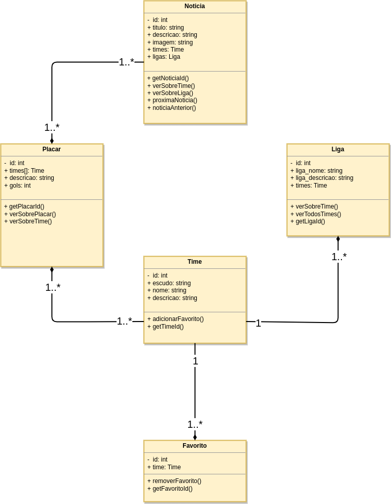
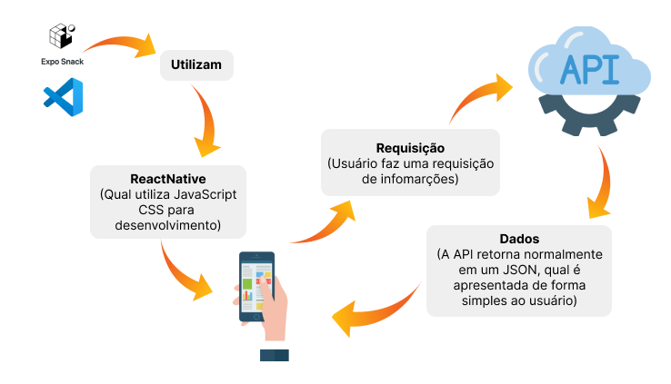

# Arquitetura da Solução

A arquitetura de solução como o próprio nome já diz é responsável por criar soluções com base nas necessidades da empresa. Também pode ser utilizada para alinhar novas soluções com uma arquitetura que já existe.

A arquitetura para a solução que iremos tratar será basicamente o desenvolvimento de um aplicativo híbrido (Aplicativo que roda código web e nativo) que se comunicará com uma API pública, qual irá trazer informações úteis para o usuário.

Todo o código será armazenado no GitHub para que todo o processo seja acompanhado e revertido, se preciso for.

Não teremos necessidade de utilizar um banco de dados para armazenamento de informações, já que o foco é apresentação de informações públicas, por este motivo não utilizaremos um banco de dados, apenas nos comunicaremos com a API e apresentaremos as informações para o usuário.

A aplicação funcionará como um site de notícias, com o foco em futebol. O usuário terá acesso inicialmente a homescreen da aplicação, onde terá diretamente acesso a várias notícias de futebol e várias opções de acesso como ver placares, resultados dos últimos jogos, ver os times favoritos dele e ligas de futebol. Entrando nos favoritos dele, terá uma lista de todos os seus favoritos, podendo ainda remove-los se desejar. Ele pode ainda clicar sobre um time para saber mais sobre o time, como uma descrição, história, etc.

O foco da aplicação é fornecer informações suficientes para ele acompanhar os jogos com base na sua preferência e resultados que na maioria das vezes é o foco do usuário.

## Diagrama de Classes

O diagrama de classes ilustra graficamente como cada uma das classes estão interligadas. Essas classes servem de modelo para materializar os objetos que executarão na memória.

No nosso caso temos algumas classes, como mostra o diagrama abaixo.

A classe de notícia que se relaciona com os placar, pois sem placar não tem notícia.
A classe de placar que está relacionada com a classe de time, pois é nela que terá informações dos times.
A classe de time que está relacionada com várias classes.
A classe de favorito que está relacionada com a classe de time, podendo adicionar novos times ou remover.
A classe de liga, que está relacionada também com a classe de time.

<!-- As referências abaixo irão auxiliá-lo na geração do artefato “Diagrama de Classes”.

> - [Diagramas de Classes - Documentação da IBM](https://www.ibm.com/docs/pt-br/rational-soft-arch/9.6.1?topic=diagrams-class)
> - [O que é um diagrama de classe UML? | Lucidchart](https://www.lucidchart.com/pages/pt/o-que-e-diagrama-de-classe-uml) -->

<!-- ## Modelo ER

O Modelo ER representa através de um diagrama como as entidades (coisas, objetos) se relacionam entre si na aplicação interativa.]

As referências abaixo irão auxiliá-lo na geração do artefato “Modelo ER”.

> - [Como fazer um diagrama entidade relacionamento | Lucidchart](https://www.lucidchart.com/pages/pt/como-fazer-um-diagrama-entidade-relacionamento)
 -->
<!-- ## Esquema Relacional

O Esquema Relacional corresponde à representação dos dados em tabelas juntamente com as restrições de integridade e chave primária.
 
As referências abaixo irão auxiliá-lo na geração do artefato “Esquema Relacional”.

> - [Criando um modelo relacional - Documentação da IBM](https://www.ibm.com/docs/pt-br/cognos-analytics/10.2.2?topic=designer-creating-relational-model)
 -->
<!-- ## Modelo Físico

Entregar um arquivo banco.sql contendo os scripts de criação das tabelas do banco de dados. Este arquivo deverá ser incluído dentro da pasta src\bd.
 -->
 
## Tecnologias Utilizadas

As tecnologias utilizadas para esta solução são: 
 - React Native (Framework baseado no React, desenvolvido pela equipe do Facebook, que possibilita o desenvolvimento de aplicações mobile híbrida)
 - JavaScript 
 - CSS
 - API noticias esporte
 - Snack Expo (https://snack.expo.dev/)
 - Visual Studio Code
 - Dispositivo real para testes

Abaixo tem uma apresentação de como as tecnologias se relacionam:

## Hospedagem

No caso da nossa solução, por ser um aplicativo mobile nós o lançaremos nas lojas dos sistemas disponíveis, sendo as mais conhecidas a Play Store e Apple Store.

<!-- > **Links Úteis**:
>
> - [Website com GitHub Pages](https://pages.github.com/)
> - [Programação colaborativa com Repl.it](https://repl.it/)
> - [Getting Started with Heroku](https://devcenter.heroku.com/start)
> - [Publicando Seu Site No Heroku](http://pythonclub.com.br/publicando-seu-hello-world-no-heroku.html) -->

## Qualidade de Software

A respeito de usabilidade julgamos importante a estética da interface, pois é necessário para atrair a atenção dos usuários para o foco da aplicação, não deixando o usuário perdido. A interface é um ponto chave de qualquer aplicação. Ainda em usabilidade, também é importante a inteligibilidade, que é o processo de entregar exatamente o que a aplicação se propôs a fazer. 
A respeito de manutenabilidade, a reusabilidade é importante, pois uma aplicação com reusabilidade de código pode ser de fácil manutenção para futuras implementações e crescimento de aplicação.
A respeito de eficiência, o comportamento em relação ao tempo é de suma importância, pois o usuário não pode ficar muito tempo esperando sobre as informações que nossa solução visa entregar.

Pretendemos que com isso nossa solução alcance um bom desempenho no tempo de resposta, que ele a aplicação seja de fácil usabilidade para que o nosso usuário tenha exatamente o que deseja, mantendo a interface simples e objetiva. E também que a manutenção do código seja mais simples, para novas implementações futuras.

<!-- Conceituar qualidade de fato é uma tarefa complexa, mas ela pode ser vista como um método gerencial que através de procedimentos disseminados por toda a organização, busca garantir um produto final que satisfaça às expectativas dos stakeholders.

No contexto de desenvolvimento de software, qualidade pode ser entendida como um conjunto de características a serem satisfeitas, de modo que o produto de software atenda às necessidades de seus usuários. Entretanto, tal nível de satisfação nem sempre é alcançado de forma espontânea, devendo ser continuamente construído. Assim, a qualidade do produto depende fortemente do seu respectivo processo de desenvolvimento.

A norma internacional ISO/IEC 25010, que é uma atualização da ISO/IEC 9126, define oito características e 30 subcaracterísticas de qualidade para produtos de software.
Com base nessas características e nas respectivas sub-características, identifique as sub-características que sua equipe utilizará como base para nortear o desenvolvimento do projeto de software considerando-se alguns aspectos simples de qualidade. Justifique as subcaracterísticas escolhidas pelo time e elenque as métricas que permitirão a equipe avaliar os objetos de interesse. -->

<!-- > **Links Úteis**:
>
> - [ISO/IEC 25010:2011 - Systems and software engineering — Systems and software Quality Requirements and Evaluation (SQuaRE) — System and software quality models](https://www.iso.org/standard/35733.html/)
> - [Análise sobre a ISO 9126 – NBR 13596](https://www.tiespecialistas.com.br/analise-sobre-iso-9126-nbr-13596/)
> - [Qualidade de Software - Engenharia de Software 29](https://www.devmedia.com.br/qualidade-de-software-engenharia-de-software-29/18209/) -->
